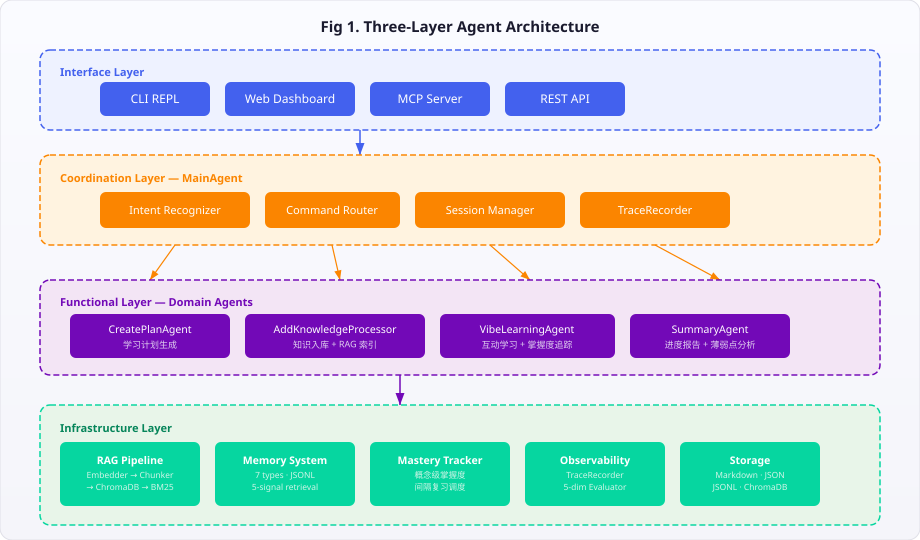
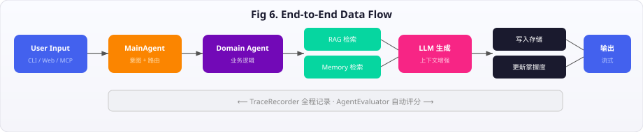
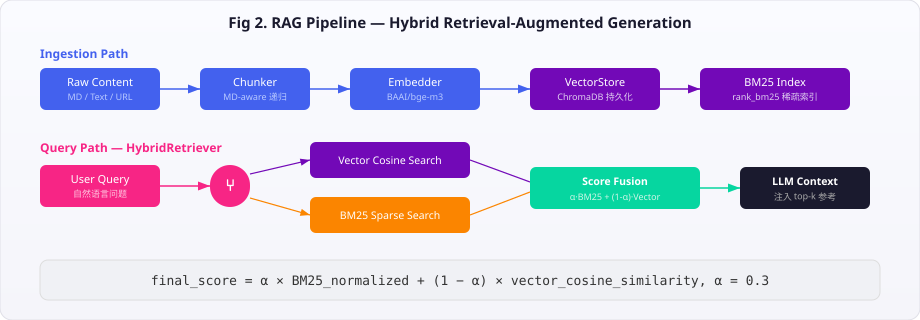
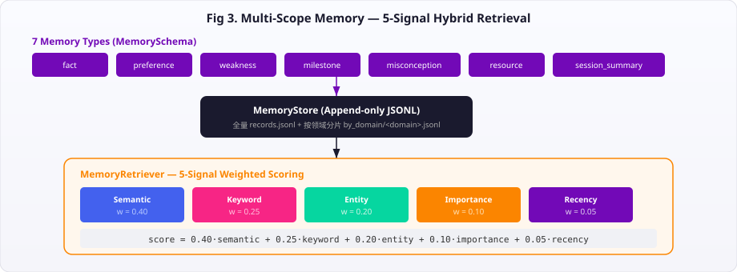
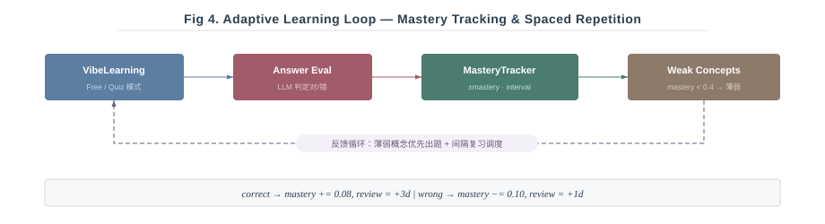
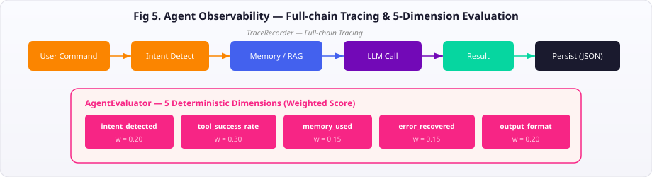

# LearningAgent

> **Personalized AI Learning Agent** with RAG, Multi-scope Memory, Adaptive Mastery Tracking & MCP Integration

[](https://www.python.org/)
[](LICENSE)
[](https://modelcontextprotocol.io)

一个具备 **RAG 混合检索**、**多范围长期记忆 (5 信号加权)**、**概念级自适应掌握度追踪**、**全链路可观测性** 和 **MCP 标准化接口** 的个性化 AI 学习代理。

> 📐 **[查看完整架构图（交互式 HTML）](docs/architecture.html)** — 包含 6 张 SVG 系统图 + 技术亮点卡片

---

## Architecture Overview

### Three-Layer Agent Architecture

<p align="center">
  
</p>

### End-to-End Data Flow

<p align="center">
  
</p>

---

## Technical Highlights

### 1. 双通道混合检索 (Hybrid RAG)

<p align="center">
  
</p>

- **稠密检索**: BAAI/bge-m3 sentence-transformers 生成向量，ChromaDB 持久化存储
- **稀疏检索**: rank_bm25 构建倒排索引，中英混合分词
- **分数融合**: 加权合并两路结果，阈值过滤后注入 LLM 上下文
- **Markdown 感知分块**: 递归分块保留文档结构，避免跨章节截断

### 2. 5 信号加权记忆检索 (Multi-scope Memory)

<p align="center">
  
</p>

- **自动降级**: 有 Embedder 用向量语义，无则 fallback 到 TF-IDF
- **实体提取**: Markdown 反引号 / CamelCase / 技术关键词规则提取
- **时效衰减**: `recency = 1 / (1 + 0.1 × days)`，新记忆权重更高

### 3. 概念级自适应学习 (Adaptive Mastery)

<p align="center">
  
</p>

- **概念粒度**: 每个知识概念独立追踪 mastery / confidence / attempt_count
- **间隔复习**: 答对延长复习间隔，答错缩短，类似简化版 SM-2 算法
- **薄弱检测**: `mastery < 0.4` 自动标记为薄弱，SummaryAgent 报告中高亮

### 4. 全链路可观测性 (Agent Observability)

<p align="center">
  
</p>

- **确定性评分**: 无需 LLM 即可量化 Agent 执行质量
- **全链路追踪**: 每条命令从路由到完成，记录 intent / steps / latency / error
- **持久化**: JSON 文件按日期归档，支持 Web Dashboard 展示

### 5. MCP 标准化接口

| 类型 | 项目 | 说明 |
|------|------|------|
| **Tools** (7) | `list_learning_domains` `get_learning_plan` `get_progress_summary` `search_learning_memory` `add_knowledge_note` `get_weak_concepts` `update_concept_mastery` | 完整学习功能 CRUD |
| **Resources** | `learning://domains` `learning://domain/{d}/plan` 等 | 静态资源暴露 |
| **Prompts** (4) | `learn_from_github_repo` `paper_to_learning_plan` `weekly_learning_review` `quiz_weak_points` | 预设提示词模板 |

通过 `FastMCP` 暴露，任何 MCP 客户端（Claude Desktop、Cursor 等）即插即用。

---

## Features

- 📚 **创建学习计划** — 基于领域描述、GitHub 项目或学术论文生成个性化学习路径
- ✨ **添加知识笔记** — 智能分类、标签化并管理学习笔记，自动写入长期记忆 + RAG 向量索引
- 💬 **互动学习** — 对话/测验两种模式，答题后自动更新概念掌握度
- 📊 **进度追踪** — 结合知识总结、长期记忆、薄弱概念生成进度报告
- 🔍 **RAG 检索增强** — ChromaDB 向量存储 + BM25 混合检索，注入学习上下文
- 🧠 **多范围长期记忆** — JSONL 存储，支持 7 种记忆类型，5 信号混合检索
- 🎓 **自适应学习** — 概念级掌握度追踪、薄弱点检测、间隔复习推荐
- 📮 **MCP Server** — 将学习功能暴露为标准化 MCP Tools/Resources/Prompts
- 📍 **Agent 可观测性** — 全链路追踪 + 5 维度确定性评估

## 快速开始

### 安装

```bash
# 克隆仓库
git clone https://github.com/wanlixing-dream/learningAgent.git
cd learningAgent

# 创建 conda 虚拟环境
conda create -n learning-agent python=3.10
conda activate learning-agent

# 安装依赖
pip install -r requirements.txt

# 配置环境变量
cp .env.example .env
# 编辑 .env 文件，填入你的 API Key
```

### 使用

```bash
# 启动 LearningAgent
python main.py

# 在 REPL 中
> /help                    # 显示帮助
> /create Python           # 创建学习计划
> /add Python # 装饰器模式  # 添加知识笔记
> /vibe Python             # 开始互动学习
> /vibe Python --mode quiz # 开始测验模式
> /summary Python          # 查看学习总结
> /list                    # 列出所有学习领域
> /exit                    # 退出
```

## 添加知识笔记

AddKnowledge 功能支持三种输入方式：

### 1. 文本输入
```bash
> /add Python # 装饰器模式
> /add 机器学习 决策树是一种监督学习算法...
```

### 2. 文件输入
```bash
> /add ~/notes/react-hooks.md
> /add ./docs/algorithm-notes.txt
```

### 3. URL 输入
```bash
> /add https://blog.example.com/post
```

### 知识组织

添加的知识会自动：
- 使用 LLM 分析内容并分类
- 提取关键概念和标签
- 生成带时间戳的文件名
- 保存到 `<领域>/knowledge/` 目录
- 更新知识摘要文件

示例文件结构：
```
~/.learning-agent/
├── Python/
│   ├── learning_plan.md
│   ├── knowledge/
│   │   ├── 20250111-算法-Python-装饰器.md
│   │   └── 20250111-通用-列表推导式.md
│   └── knowledge_summary.md
```

## 互动学习

VibeLearning 功能提供两种互动学习模式：

### 1. Free 模式（自由对话）
```bash
> /vibe Python
```
- 开放性问题，鼓励讨论
- AI 引导深入思考
- 动态调整对话方向

### 2. Quiz 模式（结构化测验）
```bash
> /vibe Python --mode quiz
```
- 结构化测验题
- 自动评估答案
- 难度逐步递增

### 学习会话记录
每次学习会话会自动：
- 记录完整对话历史
- 生成会话总结
- 保存到 `<领域>/sessions/` 目录
- 更新 session_summary.md

示例文件结构：
```
~/.learningAgent/
├── Python/
│   ├── learning_plan.md
│   ├── sessions/
│   │   ├── session_2025-01-11_14-30.md
│   │   └── session_summary.md
│   └── knowledge/
```

## 学习进度总结

Summary 功能通过分析学习计划、知识笔记和会话记录，生成个性化的学习进度报告。

### 使用方式

```bash
# 查看某个领域的学习总结
> /summary Python
> /summary 机器学习
```

### 报告内容

进度报告包含以下部分：

1. **当前水平评估**
   - 整体掌握度（百分比）
   - 所处学习阶段（入门/熟练/精通）

2. **知识点分析**
   - ✅ 掌握良好的知识点
   - ⚠️ 需要加强的知识点

3. **下一步建议**
   - 具体学习主题推荐
   - 针对性的学习建议

4. **总体建议**
   - 鼓励和指导
   - 学习策略调整

### 数据来源

SummaryAgent 综合分析以下数据：
- `plan.md` - 学习目标和计划
- `knowledge_summary.md` - 已掌握的知识
- `session_summary.md` - 学习历程和进步轨迹

## 项目结构

```
learningAgent/
├── agents/                 # 功能层 Agent
│   ├── create_plan_agent.py    # 学习计划生成
│   ├── summary_agent.py        # 进度报告 + 薄弱点分析
│   └── vibe_learning_agent.py  # 互动学习 + 掌握度追踪
├── core/                   # 核心基础设施
│   ├── main_agent.py           # 协调层：意图识别 + 路由 + 追踪
│   ├── memory_schema.py        # 7 种记忆类型定义
│   ├── memory_store.py         # JSONL 持久化存储
│   ├── memory_retriever.py     # 5 信号混合检索
│   ├── mastery_tracker.py      # 概念级掌握度 + 间隔复习
│   ├── tracing.py              # 全链路追踪记录器
│   ├── evaluation.py           # 5 维度确定性评估器
│   ├── entity_extractor.py     # 实体提取（MD/CamelCase/关键词）
│   └── rag/                    # RAG Pipeline
│       ├── embedder.py             # BAAI/bge-m3 向量化
│       ├── chunker.py              # Markdown 感知递归分块
│       ├── vector_store.py         # ChromaDB 向量存储
│       ├── retriever.py            # BM25 + Vector 混合检索
│       └── evaluator.py            # RAG 质量评估
├── processors/             # 处理器
│   └── add_knowledge.py        # 知识入库 + RAG 索引 + 记忆写入
├── specialist/             # 专业分析器
│   ├── repo_analyzer.py        # GitHub 仓库分析
│   ├── paper_analyzer.py       # 学术论文分析
│   └── quiz_generator.py       # 测验题生成
├── mcp_server/             # MCP Server (7 Tools + Resources + 4 Prompts)
├── api/                    # FastAPI REST API
├── web/                    # React + Vite + TailwindCSS 前端
├── cli/                    # CLI REPL 入口
└── main.py                 # 主入口
```

## 开发

```bash
# 运行全量测试
pytest tests/ -v

# 启动 Web Dashboard
python api/server.py             # 后端 API (localhost:8000)
cd web && npm run dev            # 前端 (localhost:5173)

# 启动 MCP Server
python -m mcp_server.server

# 代码质量
black .
mypy .
flake8 .
```

### Web Dashboard

React + TailwindCSS + Recharts 单页应用，通过 FastAPI 后端调用 LearningAgent 核心能力：

- **总览页** — 领域卡片、掌握度进度条、统计数据
- **领域详情** — 4 个 Tab：学习计划 / 知识库(含语义搜索) / 互动学习 / 掌握度(雷达图+柱状图)
- **执行追踪** — Agent 链路追踪列表、展开查看评估评分

## 开发状态

### ✅ v0.1–v0.5: 核心功能

创建计划 / 添加知识 / 互动学习 / 进度总结 / MainAgent 路由

### ✅ v0.6: RAG Pipeline

- [x] Embedder (BAAI/bge-m3 sentence-transformers)
- [x] Chunker (递归 Markdown 感知分块)
- [x] VectorStore (ChromaDB 持久化)
- [x] HybridRetriever (BM25 + Vector fusion)
- [x] RAGEvaluator (RAGAS + fallback)
- [x] 集成到 AddKnowledge / VibeLearning / Summary

### ✅ v0.7: Agent 可观测性 + 多范围记忆 + MCP

- [x] TraceRecorder — 全链路追踪 (intent → steps → result)
- [x] AgentEvaluator — 5 维度确定性评分
- [x] MemorySchema + MemoryStore — 7 种类型、JSONL 存储、按领域分片
- [x] EntityExtractor — Markdown/反引号/CamelCase/技术关键词规则提取
- [x] MemoryRetriever — 语义+关键词+实体+重要性+时效 5 信号加权
- [x] MasteryTracker — 概念级掌握度、间隔复习、薄弱点检测
- [x] MCP Server — 7 Tools + Resources + 4 Prompts
- [x] 集成到全部学习流（记忆写入/检索/掌握度/追踪）

### ✅ v0.8: Web Dashboard

- [x] FastAPI REST API — 领域/知识/掌握度/记忆/追踪全套接口
- [x] React + Vite + TailwindCSS 前端
- [x] Dashboard 总览页 — 领域卡片 + 统计数据
- [x] 领域详情页 — Plan / Knowledge / Practice / Progress 4 Tab
- [x] 掌握度可视化 — Recharts 雷达图 + 柱状图 + 薄弱点高亮
- [x] 互动学习聊天界面 + 记忆语义搜索
- [x] Agent 执行追踪面板 + 评估详情

## 文档

- 📐 [**架构图（交互式 HTML）**](docs/architecture.html) — 6 张 SVG 系统图 + 技术亮点
- [设计文档](docs/plans/2025-01-09-learningagent-design.md)
- [实施计划](docs/plans/2025-01-09-core-infrastructure.md)
- [Agent 升级路线图](docs/plans/2026-05-14-agent-upgrade-roadmap.md)
- [RAG 实施计划](docs/superpowers/plans/2026-05-17-rag-pipeline.md)

## 许可证

MIT License
