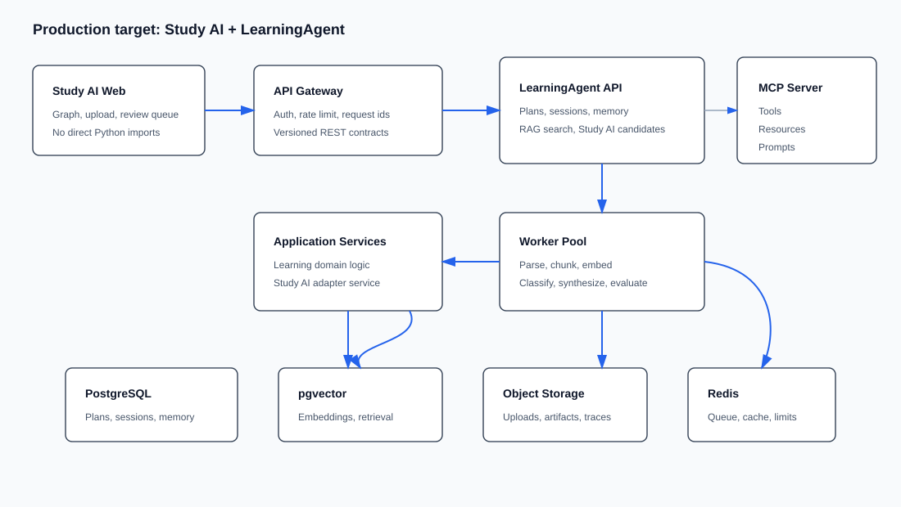
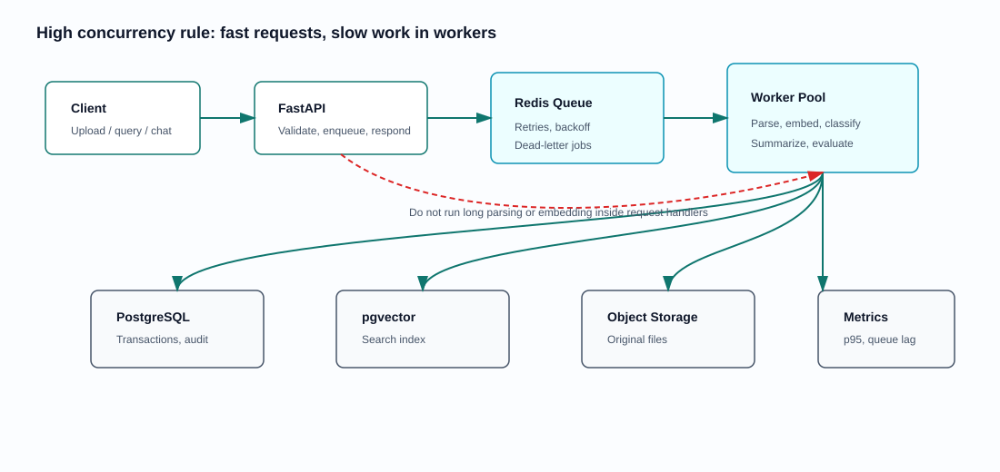
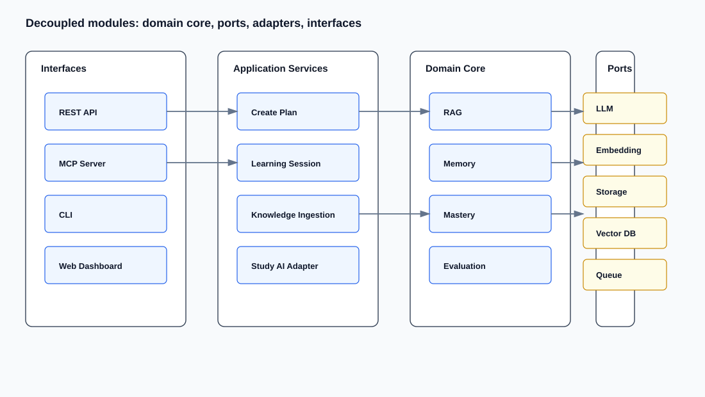

# LearningAgent

> Personalized learning-agent engine for Study AI integration. Current code is a strong local learning/RAG/MCP prototype; the target is a deployable, high-concurrency, modular service that can be reused by the Study AI knowledge graph through REST/MCP/adapters.

## Current Reuse Verdict

LearningAgent can be reused, but it should be reused as a **domain engine**, not copied directly into the Study AI frontend and not deployed as-is.

| Area | Reuse rating | Evidence in code | Production implication |
| --- | --- | --- | --- |
| Learning workflows | High | `agents/create_plan_agent.py`, `agents/vibe_learning_agent.py`, `agents/summary_agent.py`, `core/main_agent.py` | Keep the learning-plan, quiz, feedback, and summary logic as domain services. |
| RAG primitives | Medium-high | `core/rag/chunker.py`, `core/rag/vector_store.py`, `core/rag/retriever.py`, `core/rag/evaluator.py` | Reuse chunking/retrieval ideas, but move storage to production-grade adapters. |
| Memory and mastery | Medium-high | `core/memory_store.py`, `core/memory_retriever.py`, `core/mastery_tracker.py` | Keep schemas and scoring ideas; replace JSONL/file persistence for server use. |
| MCP exposure | Medium | `mcp_server/tools.py`, `mcp_server/resources.py`, `mcp_server/prompts.py`, `mcp_server/server.py` | Useful integration surface; keep wrappers thin and independent from storage internals. |
| REST API | Medium | `api/server.py` | Good dashboard prototype, but needs auth, async/job boundaries, storage abstraction, and a syntax fix before service deployment. |
| Web dashboard | Medium | `web/src/api.ts`, `web/src/pages/*` | Useful admin/demo UI; production Study AI should consume the backend through a versioned API. |
| High concurrency readiness | Low today | JSONL/Markdown/Chroma local storage, global API singletons, no locks/queue/auth | Requires a productionization pass before cloud deployment. |

## Important Current Blockers

These are not theoretical; they were found by direct repository inspection and local verification.

1. `api/server.py` currently fails `python -m compileall -q .`.
   The chat response f-string contains nested f-string/expression escaping that Python rejects.

2. RAG imports are too eager.
   `core/rag/__init__.py` imports `Embedder`, which imports `sentence_transformers`. A lightweight chunker test can fail during collection if the local `numpy`/`sklearn`/`sentence-transformers` stack is incompatible.

3. Storage is local-first, not server-first.
   `FileManager` writes Markdown under `~/.learningAgent`, `MemoryStore` uses JSONL files, `TraceRecorder` writes JSON files, and `VectorStore` uses local ChromaDB persistence.

4. API is prototype-shaped.
   `api/server.py` uses global singleton service instances, permissive CORS, synchronous request handlers, no auth, no rate limiting, and no background job system.

5. Existing roadmap had narrower scope.
   `docs/plans/2026-05-14-agent-upgrade-roadmap.md` explicitly kept database replacement, auth, multi-user deployment, and full knowledge graph database out of scope. The new Study AI target is larger and should be treated as a new productionization track.

## Integration With Study AI

Study AI should not import LearningAgent Python modules directly into the React app. The integration should be:

```text
Study AI React Graph
        |
        | REST API / MCP client
        v
Study AI Backend Adapter
        |
        | stable LearningAgent service contract
        v
LearningAgent Service
        |
        | storage/retrieval/model adapters
        v
PostgreSQL + pgvector / object storage / worker queue
```

Study AI keeps ownership of:

- knowledge graph visualization
- AI Agent technology taxonomy
- candidate review queue
- approved graph nodes and edges
- human-review invariant

LearningAgent keeps ownership of:

- personalized learning plan generation
- adaptive learning sessions
- quiz and mastery tracking
- learning memory retrieval
- RAG-assisted learning summaries
- MCP learning tools

## Production Target Architecture



Recommended target services:

- `web`: Study AI React frontend and optional LearningAgent dashboard.
- `api`: FastAPI application exposing stable REST contracts.
- `worker`: background ingestion, embedding, classification, summary, and evaluation jobs.
- `postgres`: canonical relational store.
- `pgvector`: vector search inside PostgreSQL for first production version.
- `object storage`: uploaded documents, parsed artifacts, trace exports.
- `redis`: queue, rate-limit counters, short-lived cache.
- `mcp`: optional MCP server process exposing approved learning tools.

## High-Concurrency Shape



The deployable version should avoid doing expensive work inside request handlers.

| Request type | Production behavior |
| --- | --- |
| Upload document | Store file, create job, return job id quickly. |
| Parse / embed / classify | Run in worker queue with retries and idempotency keys. |
| RAG query | Read-only API path with cached retriever, bounded top-k, timeout budget. |
| Learning chat | Stream response when possible; persist session asynchronously. |
| Mastery update | Short transaction in database. |
| Study AI candidate creation | Write candidates only; never write approved graph directly. |

## Module Decoupling Plan



Refactor toward ports/adapters:

```text
learning_agent/
  domain/
    learning_plan.py
    mastery.py
    memory.py
    rag.py
    evaluation.py
  application/
    create_plan_service.py
    learning_session_service.py
    knowledge_ingestion_service.py
    study_ai_adapter_service.py
  ports/
    llm_provider.py
    embedding_provider.py
    memory_repository.py
    vector_repository.py
    object_storage.py
    event_bus.py
  adapters/
    llm_hello_agents.py
    embedding_sentence_transformers.py
    db_postgres.py
    vector_pgvector.py
    storage_local.py
    storage_oss.py
    mcp_server.py
  interfaces/
    rest_api/
    mcp/
    cli/
```

The existing files map naturally:

- `agents/*` -> application/domain services
- `core/rag/*` -> domain RAG plus vector/embedding ports
- `core/memory_*` -> memory domain plus repository adapter
- `api/server.py` -> REST interface
- `mcp_server/*` -> MCP interface
- `web/*` -> optional dashboard

## Study AI Reuse Contract

The Study AI backend should call LearningAgent through a small contract:

```http
POST /v1/learning/plans
POST /v1/learning/sessions
POST /v1/learning/knowledge
GET  /v1/learning/domains/{domain}/summary
GET  /v1/learning/domains/{domain}/weak-concepts
POST /v1/retrieval/search
POST /v1/study-ai/candidates/from-learning-summary
```

Candidate output must be structured:

```json
{
  "candidateType": "learning_insight",
  "title": "RAG retrieval weakness",
  "summary": "The learner repeatedly misses reranking and hybrid retrieval concepts.",
  "tags": ["RAG", "retrieval", "evaluation"],
  "confidence": 0.78,
  "evidence": [
    {
      "sourceType": "learning_session",
      "sourceId": "session_2026_06_07",
      "quote": "User confused vector retrieval with reranking."
    }
  ],
  "reviewStatus": "candidate"
}
```

## Productionization Roadmap

### Phase 0: Make The Current Repo Trustworthy

- Fix `api/server.py` syntax.
- Make `core/rag/__init__.py` lazy so importing `Chunker` does not load sentence-transformers.
- Pin Python dependency versions and add a lock strategy.
- Remove `get-pip.py` from the application repo unless there is a specific bootstrap requirement.
- Run `python -m compileall -q .`, focused pytest, full pytest, and web build.

### Phase 1: Define Stable Contracts

- Add OpenAPI schemas for learning plans, sessions, memory records, mastery, traces, retrieval results, and Study AI candidate output.
- Add contract tests that do not require real LLM calls.
- Add a service-layer boundary so API/MCP/CLI call the same application services.

### Phase 2: Replace Local Persistence Behind Adapters

- Keep local file storage as a development adapter.
- Add PostgreSQL tables for domains, plans, sessions, memory records, mastery states, traces, documents, chunks, and candidates.
- Add pgvector for embeddings.
- Preserve current JSONL/Markdown data with a migration/import script.

### Phase 3: Add Worker Queue

- Move document parsing, embeddings, summary generation, RAG evaluation, and Study AI candidate synthesis into background jobs.
- Add retry, timeout, idempotency, and job status endpoints.
- Add worker health checks and dead-letter handling.

### Phase 4: Harden API For Deployment

- Add auth.
- Restrict CORS.
- Add request limits and rate limits.
- Add structured logging and request ids.
- Add model-provider timeouts and circuit breakers.
- Add streaming endpoints for long learning sessions.

### Phase 5: Study AI Adapter

- Add an adapter package that exposes LearningAgent capabilities to Study AI.
- Produce candidate knowledge only.
- Do not mutate Study AI approved graph data from LearningAgent.
- Add integration tests with mocked Study AI backend.

### Phase 6: Deployment

Local development:

```text
docker compose up web api worker postgres redis
```

Alibaba Cloud trial:

- ECS with Docker Compose.
- PostgreSQL + pgvector container first.
- Local disk or OSS-compatible storage.
- Caddy/Nginx for HTTPS.

Alibaba Cloud production:

- ECS or ACK depending on traffic.
- RDS PostgreSQL if extension policy supports required pgvector usage; otherwise managed/self-hosted PostgreSQL plan.
- OSS for documents and artifacts.
- Redis for queue/cache/rate limiting.
- CloudMonitor/log aggregation.
- Backup and restore drills.

## Evaluation Plan

A deployable learning agent needs measurable quality, not only feature demos.

| Layer | Evaluation |
| --- | --- |
| RAG retrieval | hit rate, MRR/nDCG, context precision, context recall |
| Answer generation | faithfulness, citation coverage, refusal correctness |
| Learning experience | mastery improvement, repeated-mistake reduction, review due accuracy |
| Agent workflow | tool success rate, retry success, latency, error recovery |
| Integration with Study AI | candidate quality, evidence completeness, human approval rate |
| Concurrency | p95/p99 latency, queue wait time, worker throughput, DB connection saturation |

## Local Commands

Install:

```bash
conda create -n learning-agent python=3.10
conda activate learning-agent
pip install -r requirements.txt
cp .env.example .env
```

Current CLI:

```bash
python main.py
```

Current API:

```bash
python api/server.py
```

Current Web dashboard:

```bash
cd web
npm install
npm run dev
```

Current MCP server:

```bash
python -m mcp_server.server
```

Verification targets:

```bash
python -m compileall -q .
pytest tests/ -q
cd web && npm run build
```

## Current Repository Structure

```text
learningAgent/
  agents/          learning-plan, summary, and interactive learning agents
  api/             FastAPI dashboard API
  cli/             REPL entrypoint
  core/            file, memory, RAG, mastery, tracing, evaluation
  mcp_server/      MCP tools/resources/prompts/server
  processors/      knowledge ingestion processor
  specialist/      GitHub repo, paper, and quiz specialists
  tests/           unit and integration tests
  web/             React dashboard
  docs/            architecture and implementation plans
```

## Bottom Line

LearningAgent is worth reusing. It already contains valuable learning-agent logic: learning plan generation, adaptive sessions, mastery tracking, memory retrieval, RAG primitives, tracing/evaluation, REST, Web, and MCP surfaces.

It is not yet a production service. To make it deployable and high-concurrency, keep the domain logic, but put API contracts, persistence, vector search, background jobs, auth, observability, and Study AI candidate boundaries around it.
